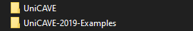

# UniCAVE 2019 Examples
Example scenes for the UniCAVE project. Project examples are made in Unity 2019.3.11f1. These example scenes are designed for use with UniCAVE 2019 version.

The UniCAVE project is located at:
https://github.com/widve/unicave

These scenes use UniCAVE as a local Unity package. The UniCAVE 2019 Examples folder should be located in the same directory as the main UniCAVE folder, like so:

See the [UniCAVE project wiki](https://github.com/widVE/UniCAVE/wiki/UniCAVE-2019:-Package-Installation) for more information.

## List of working demos:

* Tuscany - Classic Tuscany scene made for UW CAVE system

* OR - Operating Room scene made for UW CAVE system

Demos from older UniCAVE versions will be added to this repository once they are made compatible with UniCAVE 2019.
